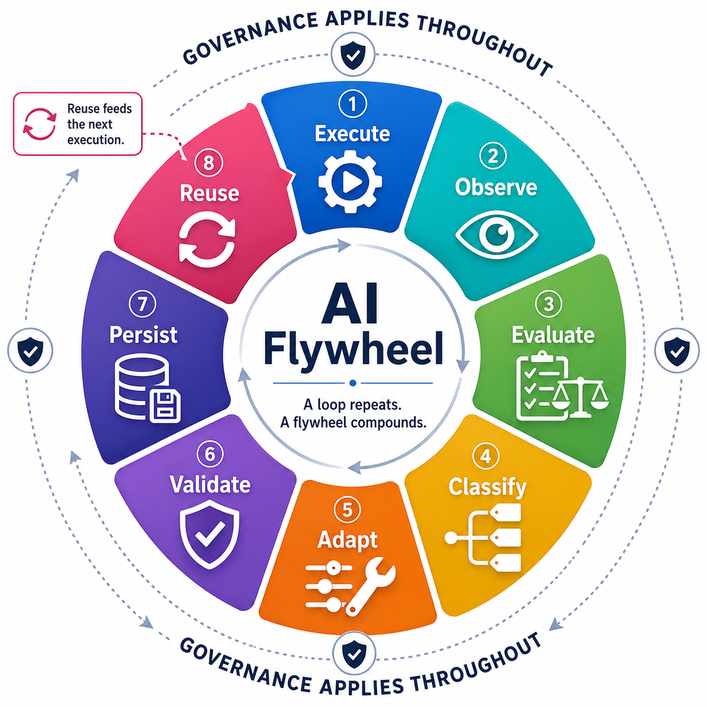

# AI Flywheel

> **Status:** Early definition and working specification. The methodology and supporting research will evolve as the model is tested, refined, and compared with related work.

The **AI Flywheel** is an evidence-driven operating model in which AI does not merely assist a human in performing work, but progressively builds, operates, observes, and improves the system by which the work is performed.

> **A loop repeats. A flywheel compounds.**

## Why AI Flywheel?

AI-assisted work often begins with a human asking AI to create something the human will use: code, a script, a procedure, or an analysis. A more autonomous pattern emerges when the AI begins operating those capabilities itself.

That creates a new question: what should happen when execution succeeds imperfectly, fails unexpectedly, or reveals a better way to perform the work?

An AI Flywheel treats execution as a source of evidence for improving the operating system of the process itself. The AI performs the work, observes what actually happened, evaluates the outcome, classifies what was learned, adapts the appropriate part of the system, validates the improvement, persists it, and reuses it in future execution.

A lesson may become better deterministic capability, improved procedural guidance, durable reasoning knowledge, stronger validation, or a proposed governance change. The next execution then begins from the improved operating state rather than starting from the same place again.

That is the flywheel effect: **the output of one cycle improves the system used by the next.**

## How the Flywheel Works

The canonical lifecycle is:

**Execute → Observe → Evaluate → Classify → Adapt → Validate → Persist → Reuse**

- **Execute** the work using procedural guidance, AI reasoning, and deterministic capabilities.
- **Observe** evidence about what actually happened.
- **Evaluate** the outcome against the intended result and success criteria.
- **Classify** the weakness, uncertainty, or learning opportunity and determine where the learning should live.
- **Adapt** the appropriate part of the operating system.
- **Validate** the proposed improvement before trusting it for future use.
- **Persist** validated and authorized learning in a durable operational asset.
- **Reuse** the improved system in future execution.

Governance applies throughout the cycle. Human-defined authority determines whether actions and changes are authorized, require approval, require human judgment, or are prohibited.

## What Makes an AI Flywheel Different?

An AI Flywheel is not defined by any single capability such as autonomous execution, memory, reflection, tool creation, code generation, self-modification, or feedback. These mechanisms all have substantial prior art.

The distinguishing hypothesis is the way the mechanisms are combined into one operating model:

| Characteristic | Traditional Automation | Typical Agent Loop | AI Flywheel |
|---|---|---|---|
| Executes work | Yes | Yes | Yes |
| Uses outcome evidence | Limited | Often | Required |
| Learns across executions | No | Sometimes | Required |
| Persists operational learning | No | Sometimes | Required |
| Chooses where learning should live | No | Framework-dependent | Explicit |
| Can move responsibility among reasoning, procedure, and deterministic capability | No | Framework-dependent | Explicit |
| Validates improvements before reuse | Release-dependent | Framework-dependent | Required |
| Explicitly governs autonomous action and adaptation | External | Framework-dependent | Required |
| Reuses improvements as part of the next operating state | No | Sometimes | Required |

Agent systems vary widely, so this table is a conceptual comparison rather than a claim that all agent frameworks behave the same way. See the [prior-art and comparative research](docs/research/frameworks/prior-art-overview.md) and [framework comparison matrix](docs/research/frameworks/framework-comparison-matrix.md) for the evidence-backed analysis.

## What an AI Flywheel Is Not

A system does not become an AI Flywheel merely because it contains one part of the pattern.

- A **retry-only loop** repeats work but does not necessarily learn from it.
- A **memory-only agent** may retain information without changing the operational system used by future execution.
- A **self-modifying system** may change code without deciding whether code is the right place for the learning.
- **Reflection alone** does not create compounding improvement unless the lesson changes a persistent operational asset that future execution can reuse.
- **Fixed automation** can be highly reliable without having an evidence-driven mechanism for evolving itself.

See [Non-Conforming Patterns](docs/specification/conformance/non-conforming-patterns.md) for the complete conformance distinctions.

## Core Concepts

### Human Authority Bounds Autonomy

A human authorizes the Flywheel and defines its authority boundaries. The AI then operates autonomously within those boundaries and escalates only when uncertainty or authority requires human involvement.

### AI Is the Operator

The AI executes the operational process and can create, invoke, interpret, and improve the capabilities it uses to perform the work.

### Three Mechanisms Work Together During Execution

The Flywheel combines:

1. **Deterministic capability** for reliable, repeatable operations.
2. **Procedural guidance, expressed as an SOP**, for defining how work should be performed and when escalation is required.
3. **AI reasoning** for orchestration, interpretation, judgment, adaptation, and ambiguity.

These are not sequential lifecycle stages. They work together during execution and become possible destinations for learning after execution produces evidence.

### The Moving Determinism Boundary

The **Moving Determinism Boundary** determines where work and learning should live among deterministic capability, procedural knowledge, and AI reasoning. Responsibility can move as evidence accumulates.

### The Authority Boundary

The **Authority Boundary** determines what the AI is permitted to decide, execute, change, or persist autonomously. The determinism boundary can move as the system learns; the authority boundary is governed by humans.

## Explore the Documentation

Start with the [documentation index](docs/README.md), or choose the path that matches what you want to understand:

- [AI Flywheel Specification](docs/specification/README.md) — The canonical definition, principles, lifecycle, governance model, and conformance assessment.
- [AI Flywheel Architecture](docs/architecture/README.md) — Runtime, learning, governance, escalation, and boundary diagrams.
- [AI Flywheel Research](docs/research/README.md) — Prior-art analysis, framework comparisons, and principle research dossiers.

The specification defines the methodology. The research collection examines related ideas, antecedents, and differentiation without making prior-art discussion part of the canonical definition.
