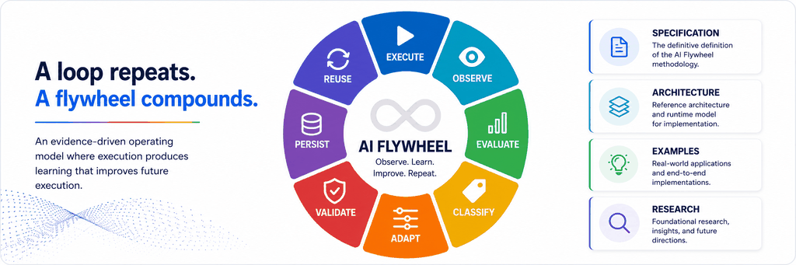

# Infoconex AI Flywheel

The **Infoconex AI Flywheel** is an evidence-driven operating model in which AI does not merely assist a human in performing work, but progressively builds, operates, observes, and improves the system by which the work is performed.

> **A loop repeats. A flywheel compounds.**

## Why the AI Flywheel?

AI-assisted work often begins with a human asking AI to create something the human will use: code, a script, a procedure, or an analysis. A more autonomous pattern emerges when the AI begins operating those capabilities itself.

That creates a new question: what should happen when execution succeeds, fails unexpectedly, exposes uncertainty, or reveals a better way to perform the work?

The AI Flywheel treats execution as a source of evidence for improving or reinforcing the system that performs the work. The AI performs the work, observes what actually happened, evaluates the outcome, classifies what was learned and whether change is justified, adapts the right part of the operating model when needed, validates learning intended for future use, persists supported learning or reinforcing evidence, and reuses the current validated operating state in future execution.

A lesson may become a better deterministic capability, improved procedural guidance, durable reasoning knowledge, stronger validation, a reusable failure rule, an applicability constraint, or a proposed governance change. A successful outcome may instead reinforce an existing validated operating pattern without requiring a new adaptation. Later execution then begins from the current validated operating state rather than starting from the same place again.

That is the flywheel effect: **evidence from one cycle strengthens the operating state used by later execution.**

## How the Flywheel Works

The lifecycle is:

**Execute → Observe → Evaluate → Classify → Adapt → Validate → Persist → Reuse**

- **Execute** the work using procedural guidance, AI reasoning, and deterministic capabilities.
- **Observe** evidence about what actually happened during execution.
- **Evaluate** the outcome against the intended result and success criteria.
- **Classify** what was learned, whether adaptation is justified, and where any resulting learning should live.
- **Adapt** by creating a candidate improvement when change is justified or explicitly resolving that no adaptation is required.
- **Validate** a candidate improvement or determine whether no-change learning intended for persistence is sufficiently supported.
- **Persist** validated and authorized learning in a durable operational asset, reinforce an existing validated pattern, or explicitly resolve that no new persistent learning is justified.
- **Reuse** relevant current persisted learning and validated operating patterns in later execution.

Governance applies throughout the cycle. Human-defined authority determines whether actions and changes are authorized, require approval, require human judgment, or are prohibited.

## What Makes the AI Flywheel Different?

The AI Flywheel is not defined by any single capability such as autonomous execution, memory, reflection, tool creation, code generation, self-modification, or feedback. These mechanisms all have substantial prior art.

The comparison below follows the AI Flywheel lifecycle so each stage can be evaluated consistently across different approaches:

| Lifecycle Stage | Traditional Automation | Typical Agent Loop | Infoconex AI Flywheel |
|---|---|---|---|
| **Execute** — Performs the work using procedures, reasoning, and deterministic capabilities | Yes | Yes | Required |
| **Observe** — Captures evidence about what actually happened during execution | Possible, not inherent | Framework-dependent | Required |
| **Evaluate** — Compares the outcome against the intended result and success criteria | Possible, not inherent | Framework-dependent | Required |
| **Classify** — Determines what was learned, whether adaptation is justified, and where any resulting learning should live | Not inherent | Framework-dependent | Required |
| **Adapt** — Creates a candidate improvement when justified or explicitly resolves no change | Release or process-dependent | Framework-dependent | Required responsibility |
| **Validate** — Tests a candidate improvement or assesses support for reusable no-change learning | Release or process-dependent | Framework-dependent | Required responsibility |
| **Persist** — Retains validated learning, reinforces an existing validated pattern, or resolves that no new persistence is needed | Possible, not inherent | Framework-dependent | Required responsibility |
| **Reuse** — Applies relevant current persisted learning or continues a validated operating pattern in later execution | Possible, not inherent | Framework-dependent | Required responsibility |
| **Governance** — Controls what may be executed, changed, or persisted | Usually external | Framework-dependent | Required throughout |

Agent systems vary widely, so this table is a general comparison rather than a claim that all agent frameworks behave the same way. See the [prior-art and comparative research](docs/research/frameworks/prior-art-overview.md) and [framework comparison matrix](docs/research/frameworks/framework-comparison-matrix.md) for the detailed analysis.

> See [Conformance](docs/specification/conformance/README.md) for the requirements used to determine whether an implementation conforms to the Infoconex AI Flywheel Specification.

## What the AI Flywheel Is Not

A system does not conform to the Infoconex AI Flywheel Specification merely because it contains one part of the pattern.

- A **retry-only loop** repeats work but does not necessarily learn from it.
- A **memory-only agent** may retain information without changing the operating model used by future execution.
- A **self-modifying system** may change code without deciding whether code is the right place for the learning.
- **Reflection alone** does not create compounding improvement unless the lesson changes a persistent operational asset that future execution can reuse.
- **Fixed automation** can be highly reliable without having an evidence-driven mechanism for evolving itself.

> See [Non-Conforming Patterns](docs/specification/conformance/non-conforming-patterns.md) for examples of systems that do not satisfy the requirements of the Infoconex AI Flywheel Specification.

## Core Concepts

### Human Authority Bounds Autonomy

A human authorizes the Flywheel and defines its authority boundaries. The AI then operates autonomously within those boundaries and escalates only when uncertainty or authority requires human involvement.

### AI Is the Operator

The AI executes the process and can create, invoke, interpret, and improve the capabilities it uses to perform the work.

### Three Mechanisms Work Together During Execution

The Flywheel combines:

1. **Deterministic capability** for reliable, repeatable operations.
2. **Procedural guidance, expressed as a Standard Operating Procedure (SOP)**, for defining how work should be performed and when escalation is required.
3. **AI reasoning** for orchestration, interpretation, judgment, problem solving, and ambiguity.

These are not sequential lifecycle stages. They work together during execution and become possible destinations for learning after execution produces evidence.

### The Moving Determinism Boundary

The **Moving Determinism Boundary** determines where work and learning should live among deterministic capability, procedural knowledge, and AI reasoning. Responsibility can move as evidence accumulates.

### The Authority Boundary

The **Authority Boundary** determines what the AI is permitted to decide, execute, change, or persist autonomously. The determinism boundary can move as the system learns; the authority boundary is governed by humans.

## Explore the Documentation

New to the AI Flywheel? Start with the core specification:

1. **[Definition](docs/specification/definition.md)** — Understand what the AI Flywheel is and what distinguishes it from related approaches.
2. **[Principles](docs/specification/principles/README.md)** — Explore the eight principles that define how the AI Flywheel operates.
3. **[Lifecycle](docs/specification/lifecycle/README.md)** — Follow the eight-stage cycle from execution through persistent reuse.
4. **[Conformance](docs/specification/conformance/README.md)** — Evaluate whether a system meets the requirements of the Infoconex AI Flywheel Specification.

Then explore the supporting material:

- **[Complete Specification](docs/specification/README.md)** — Browse the full methodology, including terminology, governance, boundaries, principles, lifecycle, and conformance.
- **[Core Operating Model](docs/architecture/operating-model.md)** — See how human authority, runtime mechanisms, governance, learning, persistence, and reuse fit together.
- **[Architecture](docs/architecture/README.md)** — Explore detailed views of runtime, learning, governance, escalation, and system boundaries.
- **[Examples](docs/examples/README.md)** — Explore concrete use cases and complete execution-to-reuse worked examples.
- **[Research](docs/research/README.md)** — Review prior-art analysis, framework comparisons, and supporting research.
- **[History and Development](docs/history.md)** — Follow the development of the methodology from its early ideas through formalization.
- **[Documentation Index](docs/README.md)** — Browse the complete documentation structure.

The specification defines the methodology. The research collection examines related ideas and how the AI Flywheel compares with them without making that research part of the specification.

## Project Policies

See [Project Policies](POLICIES.md) for ownership, permitted use, naming, contribution, governance, and versioning policies.

## Project Status and Roadmap

> **Current status:** Infoconex AI Flywheel Specification v0.2.1 — Draft. The methodology is ready for implementation testing, further research, and continued refinement.

The current methodology includes a formal definition, eight principles, an eight-stage lifecycle, governance and boundary models, conformance guidance, architecture documentation, and complete end-to-end examples.

Future work may include:

- Additional end-to-end examples
- Implementation guidance
- A reference implementation
- Conformance evaluation tooling
- Continued prior-art research

Terminology, conformance details, and supporting guidance may continue to evolve before a stable specification is declared.