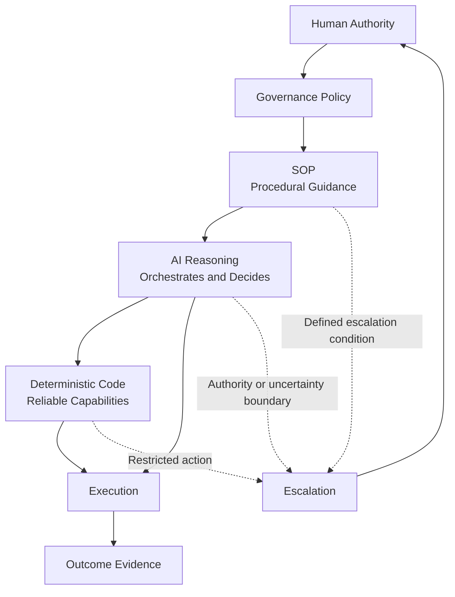
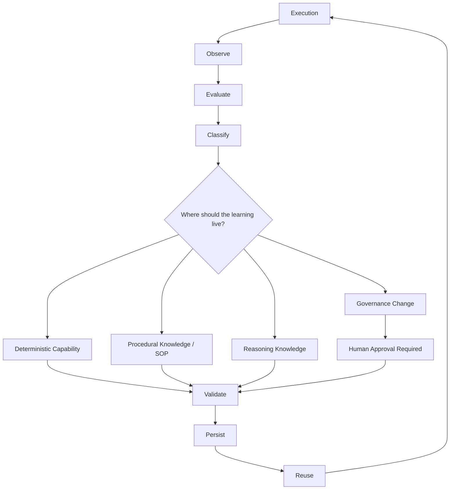
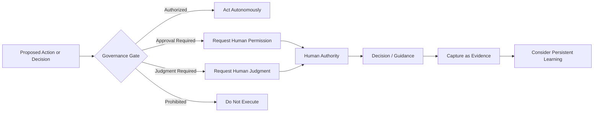

# AI Flywheel Architecture

This section explains how the AI Flywheel is organized at runtime and how learning changes the system after execution. The diagrams are starting models intended to evolve with the methodology.

## Two Views of the Same System

The three operating mechanisms—deterministic code, procedural SOP, and AI reasoning—are not sequential lifecycle stages. They are resources used during execution and possible destinations for learning after execution.

The model is easiest to understand through two complementary views:

1. **Runtime view:** how authorized work is performed.
2. **Learning view:** how evidence from execution changes future operation.

## Runtime View

Human authority establishes the scope within which the Flywheel may operate. A Governance Policy expresses that authority as persistent rules. Within those boundaries, the SOP guides the process, AI reasoning orchestrates and interprets the work, and deterministic code performs repeatable operations.

The relationship is:

> **Human authority authorizes. Governance constrains. The SOP guides. AI reasoning orchestrates. Deterministic code executes repeatable capabilities.**

The AI may invoke multiple deterministic tools, reason between tool calls, and follow or adapt procedural guidance while remaining inside governance boundaries.

## Learning View

After execution, the Flywheel observes evidence, evaluates the outcome, and classifies what was learned. Only then does it determine where a persistent improvement should live.

This is where the **Moving Determinism Boundary** operates. A recurring judgment may become procedural guidance. A stable procedure may become deterministic code. A brittle deterministic rule may move back toward procedural or AI handling when evidence shows that the environment is more variable than expected.

## Governance and Escalation

Governance and escalation are related but distinct.

**Governance** defines the boundaries before and during operation. It answers what the AI may do, what it may change, what requires approval, what is prohibited, and when uncertainty must be escalated.

**Escalation** is the runtime mechanism used when the Flywheel reaches one of those boundaries.

A useful governance rule is:

> **The AI may recommend increased autonomy, but it may not grant itself increased autonomy.**

The Flywheel may become more conservative on its own by escalating more often when unexpected risk is discovered. Expanding the AI's authority requires human authorization.

## The Two Boundaries

The architecture therefore contains two separate boundaries.

### Moving Determinism Boundary

Determines **where work and learning belong** among deterministic capability, procedural knowledge, and AI reasoning.

### Authority Boundary

Determines **what the AI is permitted to decide, execute, change, or persist autonomously**.

The first boundary is optimized through learning. The second is governed by human authority.

## Related Documents

- [AI Flywheel Specification](../specification/README.md)
- [Principles](../specification/principles.md)
- [Lifecycle](../specification/lifecycle.md)
- [Conformance Criteria](../specification/conformance.md)
