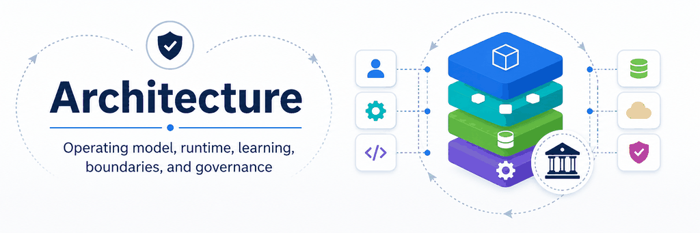

# AI Flywheel Architecture

This section explains how the AI Flywheel fits together structurally. It separates the complete operating model, runtime model, post-execution learning model, governance and escalation, and the boundaries that shape where responsibility resides and what the AI is authorized to do.

The diagrams are explanatory views intended to evolve with the methodology. They do not independently define normative requirements.

## Table of Contents

- [Core Operating Model](operating-model.md) — Shows human authority, governance, the three runtime mechanisms, the eight-stage lifecycle, learning destinations, persistence, reuse, and the core boundaries in one view.
- [Runtime Architecture](runtime-view.md) — Shows how the SOP, AI reasoning, and deterministic capabilities work together inside the Execute stage under human-authorized governance.
- [Learning Architecture](learning-view.md) — Shows how execution evidence is observed, evaluated, classified, and routed into persistent operational improvements.
- [Governance and Escalation](governance-and-escalation.md) — Defines governance gates, escalation outcomes, authority versus uncertainty, and the role of the Governance Policy.
- [Core Boundaries](boundaries.md) — Distinguishes the Moving Determinism Boundary from the Authority Boundary and explains how they interact with the Uncertainty Boundary.

## Architectural Model

The architecture is easiest to understand through three complementary operational views and two governing concepts:

1. **Complete operating model:** how human authority, execution, evidence, learning, persistence, and reuse form one system.
2. **Runtime:** how authorized work is performed.
3. **Learning:** how evidence from execution changes future operation.
4. **Governance:** how human-defined authority constrains autonomous action and triggers escalation.
5. **Boundaries:** how the system determines where responsibility belongs, what the AI may do autonomously, and when evidence is insufficient for responsible autonomous judgment.

The three operating mechanisms—deterministic capability, procedural SOP, and AI reasoning—are not sequential lifecycle stages. They work together during execution and become possible destinations for learning after execution.

For the normative methodology, see the [AI Flywheel Specification](../specification/README.md). For a concrete walkthrough, see the [Software Maintenance Flywheel example](../examples/software-maintenance-flywheel.md).