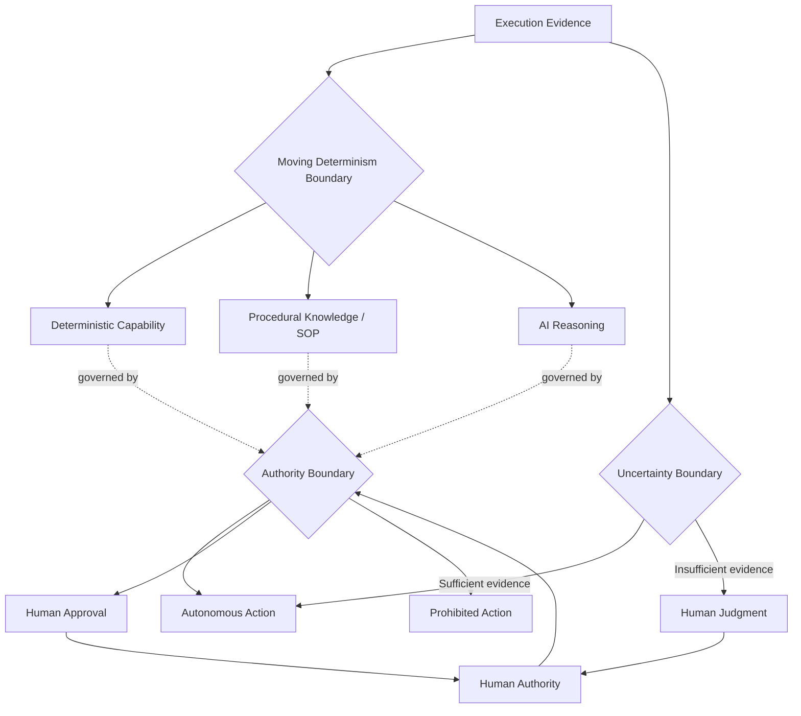

# Core Boundaries

The AI Flywheel architecture contains two core structural boundaries that should not be confused: the **Moving Determinism Boundary** and the **Authority Boundary**.

The model also uses an **Uncertainty Boundary** as an evidence-based escalation condition. It answers a different question: whether the AI has enough evidence to decide responsibly.

## Moving Determinism Boundary

The Moving Determinism Boundary determines **where work and learning belong** among deterministic capability, procedural knowledge, and AI reasoning.

This boundary can move as evidence accumulates.

Examples include:

- a recurring AI judgment becoming an SOP rule,
- a stable SOP procedure becoming deterministic code,
- a brittle deterministic rule moving back toward procedural handling,
- or a previously codified behavior returning to AI judgment because the environment has become too variable for reliable deterministic treatment.

The Moving Determinism Boundary is optimized through learning.

## Authority Boundary

The Authority Boundary determines **what the AI is permitted to decide, execute, change, or persist autonomously**.

This boundary is governed by humans. The AI can propose a change to its delegated authority but cannot expand its own authority.

An action may therefore be well understood and still require human approval.

The Authority Boundary is expressed through the Governance Policy and enforced through governance gates and escalation.

## Uncertainty Boundary

The Uncertainty Boundary determines **whether the available evidence is sufficient for the AI to make a responsible autonomous judgment**.

An action may fall within the AI's delegated authority while still requiring escalation because the evidence is incomplete, contradictory, or too ambiguous.

This requires human judgment or additional evidence rather than permission alone.

The Uncertainty Boundary is not a responsibility-allocation boundary and does not define the AI's authority. It is an escalation boundary based on evidence sufficiency.

## How the Boundaries Interact

The boundaries answer different questions:

> **Moving Determinism Boundary:** Where should this responsibility or learning live?

> **Authority Boundary:** Is the AI allowed to make this decision or change on its own?

> **Uncertainty Boundary:** Does the AI have enough evidence to decide responsibly?

A learning cycle may decide that a recurring judgment should become deterministic code while governance still requires human approval before that code is created, deployed, or used in a particular context.

Likewise, a human may authorize broad autonomy while the Moving Determinism Boundary still determines that some work should remain in AI reasoning because it is too variable to encode reliably.

A fully authorized action may still require human judgment when the evidence needed to choose among possible actions is insufficient.

## Recommended Mental Model

The architecture can be understood in five steps:

1. **Before and during execution:** governance determines what is allowed.
2. **During execution:** SOP, AI reasoning, and deterministic capability work together; insufficient evidence may trigger the Uncertainty Boundary.
3. **After execution:** evidence is evaluated and the Flywheel determines where learning should persist.
4. **Before persistence or reuse:** the improvement is validated and governance requirements are satisfied.
5. **On the next execution:** the improved system becomes the new starting point.

The Moving Determinism Boundary governs **where intelligence and responsibility reside**. The Authority Boundary governs **where human authority must remain**. The Uncertainty Boundary governs **when evidence is insufficient for responsible autonomous judgment**.

## Related Documents

- [Architecture Overview](README.md)
- [Core Operating Model](operating-model.md)
- [Runtime Architecture](runtime-view.md)
- [Learning Architecture](learning-view.md)
- [Governance and Escalation](governance-and-escalation.md)
- [AI Flywheel Formal Definition](../specification/definition.md)
- [Terminology](../specification/terminology.md)
