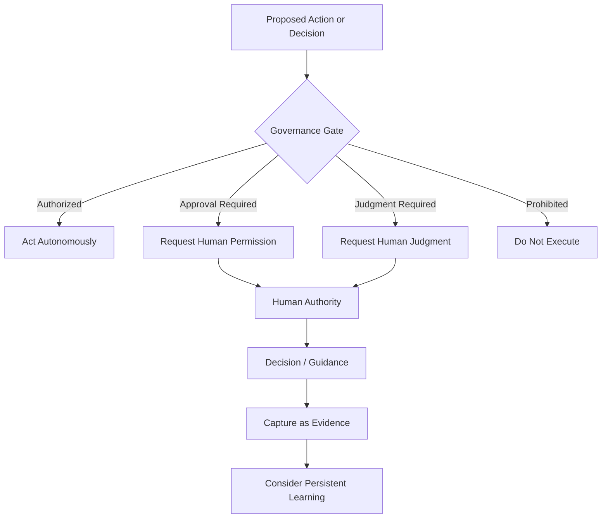

# Governance and Escalation

Governance and escalation are related but different parts of the architecture.

**Governance** defines the boundaries before and during operation. It answers what the AI may do, what it may change, what requires approval, what is prohibited, and when uncertainty must be escalated.

**Escalation** is what happens when the Flywheel reaches one of those boundaries.

## Governance Outcomes

A meaningful proposed action or decision should resolve to one of four outcomes.

### Authorized

The AI understands the action and has authority to perform it. The Flywheel continues on its own.

### Approval Required

The AI can determine the preferred action but does not have authority to perform it on its own. The Flywheel requests human permission.

### Judgment Required

The available evidence is not enough, is contradictory, or is too unclear for a responsible AI decision. The Flywheel requests human judgment.

### Prohibited

The Governance Policy prevents the action. The Flywheel does not execute it. Changing that restriction requires an authorized governance change rather than treating it as a normal approval request.

## The Governance Policy

The Governance Policy is the persistent, human-authorized contract that defines the scope of AI autonomy, including:

- permitted actions,
- approval requirements,
- escalation conditions,
- prohibited actions,
- risk or impact thresholds,
- authority to change operational assets,
- and who or what role may authorize particular decisions.

The Governance Policy sits above the SOP. The SOP describes how work should be performed; the Governance Policy defines what the Flywheel is allowed to decide, execute, change, or persist while performing that work.

The SOP cannot override the Governance Policy.

## Authority and Uncertainty

Escalation can happen for two different reasons.

### Authority Boundary

The AI knows what it recommends but does not have permission to act.

> **This requires human permission.**

### Uncertainty Boundary

The AI does not have enough evidence to responsibly determine what should happen.

> **This requires human judgment.**

This distinction prevents uncertainty from being confused with lack of permission.

## Governing Autonomy

A core governance rule is:

> **The AI may recommend increased autonomy, but it may not grant itself increased autonomy.**

The Flywheel may become more conservative on its own by escalating more often when unexpected risk is discovered. Expanding authority requires human authorization.

Human decisions should also become evidence when appropriate. Repeated approvals or judgments may reveal opportunities to improve the SOP, create better classification rules, add deterministic capabilities, or propose changes to the AI's authority.

Where practical, escalation should pause only the affected decision or action. Other authorized work should continue rather than unnecessarily stopping the entire Flywheel.

## Related Documents

- [Architecture Overview](README.md)
- [Runtime Architecture](runtime-view.md)
- [Learning Architecture](learning-view.md)
- [Core Boundaries](boundaries.md)
- [Principle 1: Autonomy Is Bounded by Human Authority](../specification/principles/01-human-authority.md)
