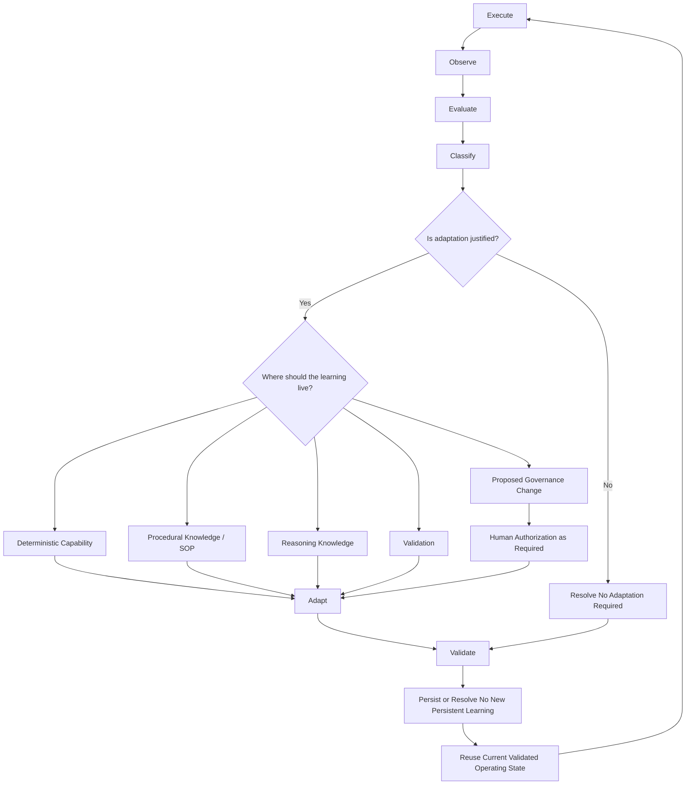

# Learning Architecture

The Infoconex AI Flywheel learning view explains what happens **after execution** and how evidence changes or reinforces future operation.

Deterministic capability, procedural knowledge, and reasoning knowledge appear again here, but now as possible destinations for persistent learning rather than as execution stages.

After execution, the Flywheel observes evidence, evaluates the outcome, and classifies what was learned. Classification also determines whether adaptation is justified and where any resulting learning should live.

When change is justified, learning may be routed to:

- **Deterministic capability** — Code, tools, scripts, or other repeatable executable behavior.
- **Procedural knowledge** — SOP rules, process guidance, known exceptions, and escalation instructions.
- **Reasoning knowledge** — Durable guidance, examples, heuristics, memory, or context that improves future AI judgment.
- **Validation** — Evaluation criteria, tests, detection mechanisms, or other ways of determining whether outcomes are acceptable.
- **Governance** — Proposed changes to authority, permissions, prohibited actions, or approval requirements. Governance changes require human authorization when they alter authority.

Not every execution must produce an adaptation. A successful or acceptable outcome may reinforce an existing validated operating pattern. In that case, Adapt explicitly resolves that no candidate change is required, Validate assesses any reinforcing or reusable learning intended for persistence, Persist may associate sufficiently supported evidence with the existing pattern, and Reuse continues to apply the current validated operating state.

This is where the **Moving Determinism Boundary** operates. A recurring judgment may become procedural guidance. A stable procedure may become deterministic code. A brittle deterministic rule may move back toward procedure or AI reasoning when evidence shows that the environment is more variable than expected.

The key distinction is:

> **The operating mechanisms are used during execution. The decision about whether and where learning should change the operating state occurs after execution, observation, evaluation, and classification.**

Failed or rejected adaptations can also produce reusable learning without becoming approved behavior themselves. That separate lesson must follow the lifecycle and be validated before it becomes persistent operational learning.

Persisted learning remains subject to later evidence. Reuse can reveal that prior learning should be narrowed, revised, superseded, deprecated, invalidated, rolled back, or retired through the lifecycle again.

A proposed change may also reach an authority boundary. The Flywheel can recommend a governance change or more autonomy, but it cannot grant itself more authority. That path is described in [Governance and Escalation](governance-and-escalation.md).

## Related Documents

- [Architecture Overview](README.md)
- [Runtime Architecture](runtime-view.md)
- [Governance and Escalation](governance-and-escalation.md)
- [Core Boundaries](boundaries.md)
- [Infoconex AI Flywheel Lifecycle](../specification/lifecycle/README.md)
- [Persisted Learning Requirements](../specification/persisted-learning.md)
- [Reuse Evidence Requirements](../specification/reuse-evidence.md)
- [Learning Supersession Requirements](../specification/learning-supersession.md)