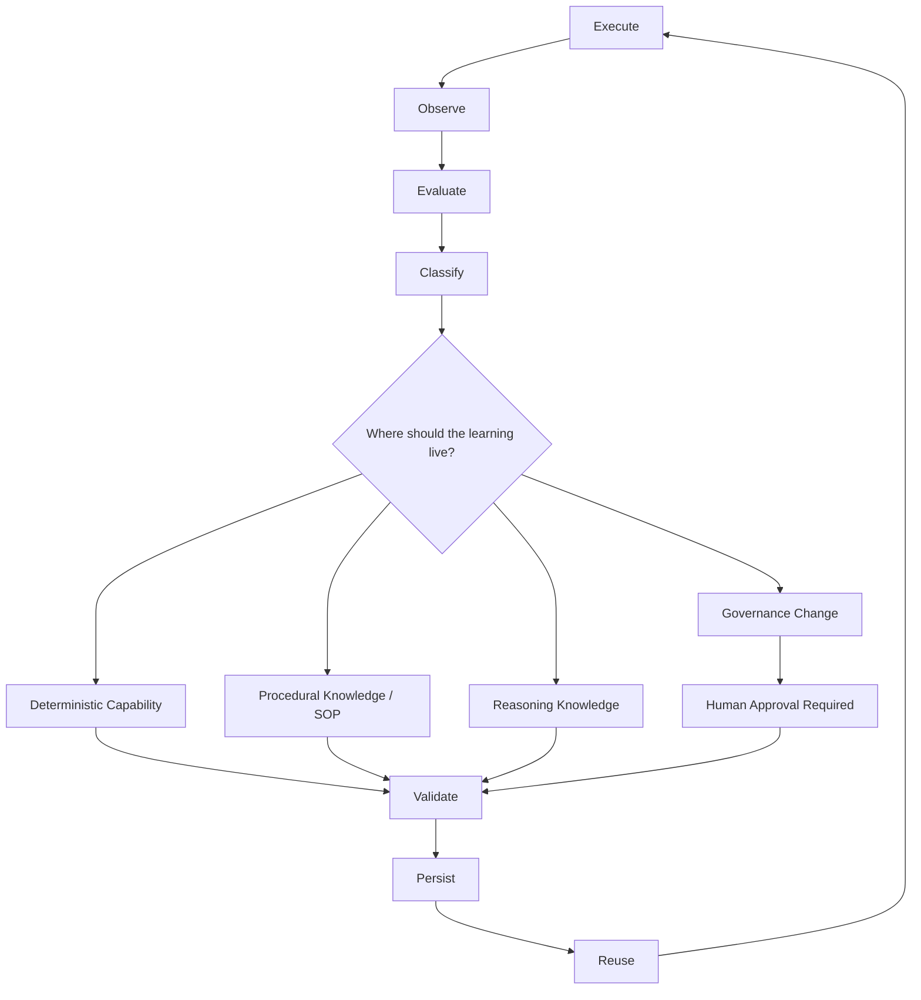

# Learning Architecture

The Infoconex AI Flywheel learning view explains what happens **after execution** and how evidence changes future operation.

Deterministic capability, procedural knowledge, and reasoning knowledge appear again here, but now as possible destinations for persistent learning rather than as execution stages.

After execution, the Flywheel observes evidence, evaluates the outcome, and classifies what was learned. Only then does it determine where a persistent improvement should live.

The learning destinations are:

- **Deterministic capability** — Code, tools, scripts, or other repeatable executable behavior.
- **Procedural knowledge** — SOP rules, process guidance, known exceptions, and escalation instructions.
- **Reasoning knowledge** — Durable guidance, examples, heuristics, memory, or context that improves future AI judgment.
- **Governance** — Changes to authority, permissions, prohibited actions, or approval requirements. Governance changes require human authorization.

This is where the **Moving Determinism Boundary** operates. A recurring judgment may become procedural guidance. A stable procedure may become deterministic code. A brittle deterministic rule may move back toward procedure or AI reasoning when evidence shows that the environment is more variable than expected.

The key distinction is:

> **The operating mechanisms are used during execution. The decision about where learning should persist occurs after execution, observation, evaluation, and classification.**

Not every execution must produce a change. Stable successful behavior should remain stable. The Flywheel should adapt when evidence supports a lasting improvement and then validate that improvement before reuse.

A proposed change may also reach an authority boundary. The Flywheel can recommend a governance change or more autonomy, but it cannot grant itself more authority. That path is described in [Governance and Escalation](governance-and-escalation.md).

## Related Documents

- [Architecture Overview](README.md)
- [Runtime Architecture](runtime-view.md)
- [Governance and Escalation](governance-and-escalation.md)
- [Core Boundaries](boundaries.md)
- [Infoconex AI Flywheel Lifecycle](../specification/lifecycle/README.md)
