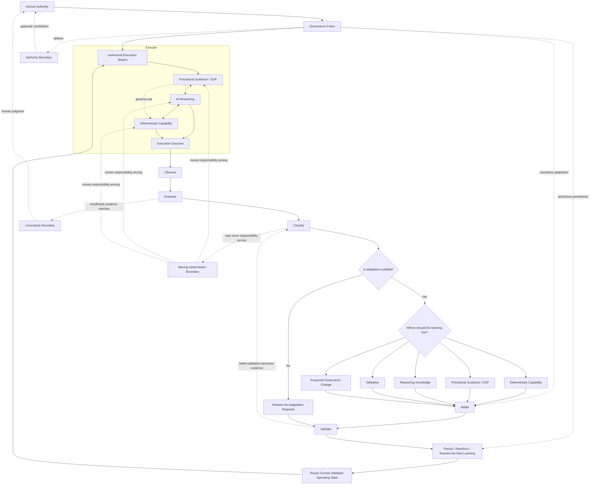

# Core Operating Model

This view shows the complete Infoconex AI Flywheel operating model in one place: human authority and governance above execution, the three operating mechanisms working together during execution, and the lifecycle turning outcome evidence into validated persistent learning or reinforcing an existing validated operating state.

The diagram is explanatory. The actual requirements are defined by the [Infoconex AI Flywheel Specification](../specification/README.md).

In the diagram, **SOP** means **Standard Operating Procedure**.

## Reading the Model

### Human Authority and Governance Sit Above the Cycle

Humans establish the authority within which the AI Flywheel may operate. The persistent Governance Policy determines what the AI may decide, execute, change, and persist on its own.

Governance is not a lifecycle stage. It applies throughout execution and self-improvement.

This relationship is defined by [Principle 1: Autonomy Is Bounded by Human Authority](../specification/principles/01-human-authority.md).

### Three Mechanisms Work Together During Execution

Execution combines:

- **Deterministic capability** for stable repeatable behavior
- **Procedural guidance** for persistent direction
- **AI reasoning** for interpretation, orchestration, judgment, and ambiguity

These are not three lifecycle stages. They are operating mechanisms used together while the AI performs the work.

Their relationship is defined most directly by [Principle 3: Work Is Distributed Across a Moving Determinism Boundary](../specification/principles/03-moving-determinism-boundary.md) and [Principle 4: The SOP Is an Operational Control Plane](../specification/principles/04-sop-control-plane.md).

### Execution Produces Evidence

Work generates outputs, errors, state changes, validations, and human decisions that become outcome evidence.

Observation and evaluation determine what actually happened rather than relying on task completion or AI confidence alone.

This relationship is defined by [Principle 5: Execution Must Produce Outcome Evidence](../specification/principles/05-outcome-evidence.md).

### Classification Determines Whether and Where the System Evolves

After evaluation, the Flywheel classifies what was learned and asks two related questions:

> **Is adaptation justified?**
>
> **If learning should change the operating state, where should it live?**

When change is justified, learning may be routed to deterministic capability, procedural guidance, reasoning knowledge, validation, or a proposed governance change. When change is not justified, the lifecycle explicitly resolves a no-change path and may still retain reinforcing evidence for an existing validated pattern.

This is the core behavior defined by [Principle 6: Failure Determines Where the System Evolves](../specification/principles/06-evolution-routing.md).

### The Moving Determinism Boundary Can Move in Either Direction

Classification may reveal that responsibility currently lives in the wrong mechanism.

Repeated stable reasoning may move toward procedure or deterministic capability. Brittle deterministic behavior may move back toward procedure or AI reasoning when context and judgment are required.

The goal is not maximum determinism. The goal is to put responsibility where it can be handled most reliably without removing flexibility that is still needed.

### Validation and Authority Are Separate Gates

A candidate improvement or other learning intended for persistent future use must be sufficiently supported before it is trusted, but evidence that something works does not automatically authorize persistence.

A change may:

- Validate successfully but still require human approval
- Be authorized in principle but fail validation
- Be prohibited even if evidence suggests it would work

A successful no-change cycle does not require manufacturing a candidate improvement. Validate instead determines whether any reinforcing or reusable learning intended for persistence is sufficiently supported.

### Persistence and Reuse Create the Flywheel Effect

Validated and authorized learning can change a durable operational asset. Sufficiently supported evidence can also reinforce an existing validated operating pattern without changing behavior. Later executions use the relevant current operating state rather than starting from the same state or rediscovering prior learning.

Persisted learning is not permanently authoritative. New evidence can challenge, narrow, supersede, invalidate, or retire earlier learning through the lifecycle again.

This relationship is defined by [Principle 7: Learning Must Change a Persistent Operational Asset](../specification/principles/07-persistent-learning.md) and [Principle 8: Improvement Must Compound Through Reuse](../specification/principles/08-compounding-reuse.md).

## Core Boundary Questions

The model uses three boundary questions that should not be confused:

- The **Moving Determinism Boundary** asks: **Where should responsibility live?**
- The **Authority Boundary** asks: **What may the AI do on its own?**
- The **Uncertainty Boundary** asks: **Is the available evidence enough for the AI to decide responsibly?**

The first two are core structural boundaries. The Uncertainty Boundary is an evidence-based escalation boundary.

See [Core Boundaries](boundaries.md) for the detailed relationship.

## Related Documents

- [Runtime Architecture](runtime-view.md)
- [Learning Architecture](learning-view.md)
- [Governance and Escalation](governance-and-escalation.md)
- [Core Boundaries](boundaries.md)
- [Worked Example: Continuous Dependency Maintenance](../examples/software-maintenance/worked-example.md)