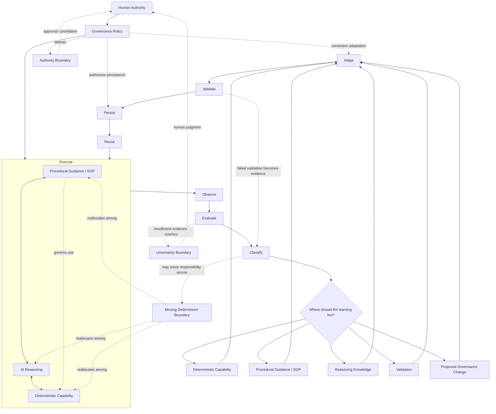

# Core Operating Model

This view shows the complete AI Flywheel operating model in one place: human authority and governance above execution, the three operating mechanisms working together during execution, and the lifecycle converting outcome evidence into validated persistent learning.

The diagram is explanatory rather than independently normative. Canonical requirements are defined by the [AI Flywheel Specification](../specification/README.md).

## Reading the Model

### Human Authority and Governance Sit Above the Cycle

Humans establish the authority within which the AI Flywheel may operate. The persistent Governance Policy determines what the AI may decide, execute, change, and persist autonomously.

Governance is not a lifecycle stage. It constrains execution and self-improvement continuously.

This relationship is defined by [Principle 1: Autonomy Is Bounded by Human Authority](../specification/principles/01-human-authority.md).

### Three Mechanisms Work Together During Execution

Execution combines:

- **deterministic capability** for stable repeatable behavior,
- **procedural guidance** for persistent operational direction,
- and **AI reasoning** for interpretation, orchestration, judgment, and ambiguity.

These are not three lifecycle stages. They are operating mechanisms used together while the AI performs the work.

Their relationship is defined most directly by [Principle 3: Work Is Distributed Across a Moving Determinism Boundary](../specification/principles/03-moving-determinism-boundary.md) and [Principle 4: The SOP Is an Operational Control Plane](../specification/principles/04-sop-control-plane.md).

### Execution Produces Evidence

Operational work generates outputs, errors, state changes, validations, and human decisions that become outcome evidence.

Observation and evaluation determine what actually occurred rather than relying on task completion or AI confidence alone.

This relationship is defined by [Principle 5: Execution Must Produce Outcome Evidence](../specification/principles/05-outcome-evidence.md).

### Classification Determines Where the System Evolves

After evaluation, the Flywheel classifies the weakness, uncertainty, or learning opportunity and asks:

> **Where should this learning live?**

The answer may route learning toward deterministic capability, procedural guidance, reasoning knowledge, validation, or a proposed governance change.

This is the core behavior defined by [Principle 6: Failure Determines Where the System Evolves](../specification/principles/06-evolution-routing.md).

### The Moving Determinism Boundary Is Bidirectional

Classification may reveal that responsibility currently lives in the wrong mechanism.

Repeated stable reasoning may move toward procedure or deterministic capability. Brittle deterministic behavior may move back toward procedure or AI reasoning when context and judgment are required.

The goal is not maximum determinism. The goal is the most reliable allocation that preserves necessary adaptability.

### Validation and Authority Are Separate Gates

A proposed improvement must be validated before it is trusted for future reuse, but technical validity does not automatically authorize persistence.

A change may:

- validate successfully but still require human approval,
- be authorized in principle but fail technical validation,
- or be prohibited regardless of technical feasibility.

### Persistence and Reuse Create the Flywheel Effect

Validated and authorized learning changes a durable operational asset. Later executions inherit relevant improvements rather than starting from the same operating state.

This relationship is defined by [Principle 7: Learning Must Change a Persistent Operational Asset](../specification/principles/07-persistent-learning.md) and [Principle 8: Improvement Must Compound Through Reuse](../specification/principles/08-compounding-reuse.md).

## Two Boundaries, Two Different Questions

The model contains two boundaries that should not be confused:

- The **Moving Determinism Boundary** asks: **Where should responsibility live?**
- The **Authority Boundary** asks: **What may the AI do autonomously?**

The **Uncertainty Boundary** adds a third operational question: **Is the available evidence sufficient for the AI to decide responsibly?**

See [Core Boundaries](boundaries.md) for the detailed relationship.

## Related Documents

- [Runtime Architecture](runtime-view.md)
- [Learning Architecture](learning-view.md)
- [Governance and Escalation](governance-and-escalation.md)
- [Core Boundaries](boundaries.md)
- [Worked Example: Software Maintenance Flywheel](../examples/software-maintenance-flywheel.md)
