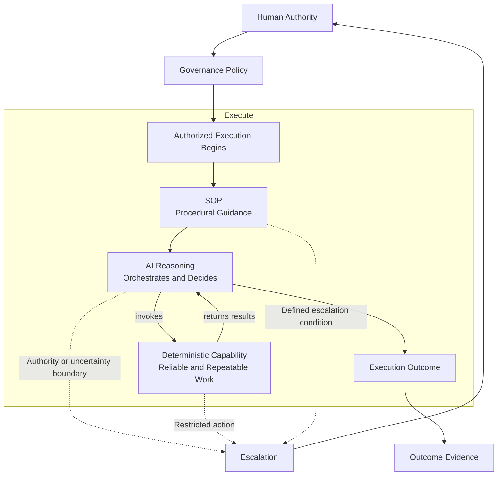

# Runtime Architecture

The runtime view explains how an authorized Infoconex AI Flywheel performs work during the **Execute** stage.

The three operating mechanisms—procedural SOP, AI reasoning, and deterministic capability—are not sequential lifecycle stages. They work together during execution.

Human authority establishes the scope within which the Flywheel may operate. A Governance Policy expresses that authority as persistent rules. Within those boundaries, the SOP guides the process, AI reasoning coordinates and interprets the work, and deterministic capabilities perform repeatable operations.

The relationship is:

> **Human authority authorizes. Governance constrains. The SOP guides. AI reasoning orchestrates. Deterministic capability performs repeatable work.**

This diagram does not mean every execution follows one linear tool call. The AI may invoke several deterministic capabilities, reason between calls, interpret results, and continue working while following the SOP and remaining within governance boundaries.

Execution brings three mechanisms together:

- **Procedural SOP** provides persistent process guidance, known conditions, expected outcomes, and escalation rules.
- **AI reasoning** interprets context, chooses actions, coordinates capabilities, handles ambiguity, and decides when escalation is necessary.
- **Deterministic capability** performs work that can be made reliably repeatable, testable, and efficient.

Execution is not learning by itself. It must first produce outcome evidence that can be observed and evaluated by the learning cycle described in the [Learning Architecture](learning-view.md).

## Related Documents

- [Architecture Overview](README.md)
- [Learning Architecture](learning-view.md)
- [Governance and Escalation](governance-and-escalation.md)
- [Core Boundaries](boundaries.md)
- [Infoconex AI Flywheel Lifecycle](../specification/lifecycle/README.md)
