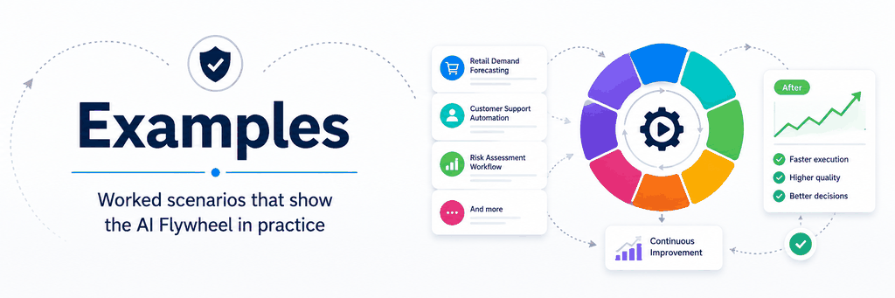

# AI Flywheel Examples

This section contains end-to-end examples showing how the AI Flywheel specification can be applied to real operating processes.

Examples help explain the methodology but do not add new requirements. The requirements remain in the [AI Flywheel Specification](../specification/README.md).

## Examples

- [Software Maintenance Flywheel](software-maintenance-flywheel.md) — Walks an AI-operated dependency-maintenance process through governance, execution, evidence, failure classification, Standard Operating Procedure (SOP) improvement, deterministic capability improvement, validation, persistence, and reuse.

## How to Read the Examples

A complete end-to-end example should make the following clear:

- What humans authorize
- What the AI operates
- What belongs in deterministic capability
- What belongs in procedural guidance
- What requires AI reasoning
- What outcome evidence is collected
- How weaknesses are classified
- Where improvements are sent
- How changes are validated and authorized
- What persists
- How later execution reuses the improved operating state

The purpose is not to require one implementation architecture. It is to show how the parts of the specification work together in practice.