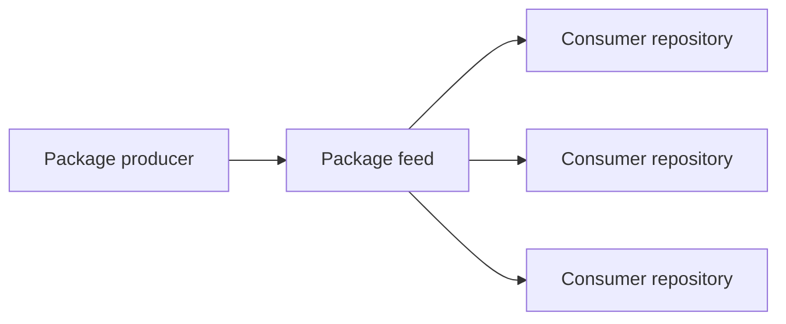

# Use Case: Continuous Dependency Maintenance

## Summary

This simulated use case describes continuous dependency maintenance across a portfolio of software repositories.

Dependencies change after software is released. New versions become available, vulnerabilities are discovered, packages become unsupported, licenses change, and framework upgrades introduce new compatibility requirements.

The goal is not merely to generate a list of outdated packages. The AI operates a governed maintenance process that selects work, applies approved changes, validates outcomes, creates draft pull requests, and uses evidence from completed maintenance to improve later executions.

## Objective

The objective is to maintain dependency health through a repeatable process that:

- Identifies dependency-maintenance needs
- Prioritizes work using risk and repository context
- Selects an approved maintenance profile
- Applies changes within defined authority
- Preserves required build, test, security, and review controls
- Evaluates outcomes rather than relying on command completion
- Records evidence and human decisions
- Improves the operational assets used by later maintenance

## Maintenance Triggers

Maintenance may begin because of:

- An approved dependency version becoming outdated
- A reported security vulnerability
- A deprecated or unsupported package
- A package-version policy violation
- A license-policy concern
- An incompatible transitive dependency
- A framework change requiring dependency updates
- A package being replaced by an approved alternative
- A human-scheduled maintenance campaign

The trigger establishes why the work exists but does not determine which action is safe.

## Dependency Inventory

A persistent dependency inventory supports selection, prioritization, and evidence.

It may record:

- Repository
- Project
- Package name
- Current version
- Approved target version or range
- Direct or transitive relationship
- Known vulnerabilities
- Package support status
- License classification
- Dependent packages
- Available versions
- Last evaluation
- Maintenance status
- Selected maintenance profile
- Known producer and consumer relationships

The inventory is an operational asset. Completed maintenance may correct or enrich it.

## Risk Classification

Not every dependency change receives the same authority or validation.

| Risk Level | Example | Expected Handling |
|---|---|---|
| **Low** | Approved patch update without known breaking changes | May run autonomously within policy |
| **Medium** | Minor update with changed transitive dependencies | Requires expanded validation |
| **High** | Major version or package replacement | Requires approval before application |
| **Urgent** | Actively exploited vulnerability | Receives priority but does not bypass controls |

Risk classification may consider:

- Version change type
- Vulnerability severity
- Exploit availability
- Package criticality
- Number of affected repositories
- Transitive dependency changes
- Public API changes
- Framework compatibility
- Test coverage
- Security and compliance requirements

Urgency changes priority. It does not remove required governance or validation.

## Maintenance Profiles

A maintenance profile defines the expected procedure, evidence, validation, and approval conditions for a known dependency-change pattern.

Profiles may include:

- Approved patch update
- Minor-version update
- Major-version update
- Vulnerability remediation
- Deprecated-package replacement
- Transitive-dependency remediation
- Multi-target compatibility update
- Package removal
- License remediation

A profile may define:

- Matching conditions
- Approved version policy
- Required commands
- Required validation
- Known exceptions
- Approval conditions
- Rollback expectations
- Required evidence

The full set of profiles is not expected to be known initially. Completed maintenance may reveal a reusable pattern that requires a new or revised profile.

## Repository Selection and Prioritization

The AI may recommend maintenance order using:

- Vulnerability severity
- Exploit availability
- Dependency age
- Package support status
- Number of affected repositories
- Repository criticality
- Update risk
- Test coverage
- Existing maintenance campaign
- Human priority

Humans may review and override the order. The reason for an override is retained as planning evidence.

## Maintenance Campaigns

The process supports:

- **Single-repository maintenance** for a specific dependency need
- **Portfolio-wide campaigns** for a package, vulnerability, support change, or policy requirement affecting many repositories

A campaign may record:

- Target dependency
- Reason for maintenance
- Approved version policy
- Affected repositories
- Selected profiles
- Progress
- Exceptions
- Results
- Reusable learning

## Initial Maintenance Process

A representative maintenance run requires the AI to:

1. Select an approved repository and dependency need
2. Confirm the applicable policy and profile
3. Create a working branch
4. Apply the approved dependency change
5. Restore and build the project
6. Run required tests and security checks
7. Inspect direct and transitive dependency changes
8. Inspect changed files
9. Evaluate evidence against success criteria
10. Create a draft pull request when validation succeeds
11. Escalate when safe completion exceeds AI authority

The AI operates the process rather than merely generating instructions for a developer.

## Intended Outcome

The intended outcome is a governed maintenance result supported by evidence.

For a completed update, the draft pull request should:

- Satisfy the approved dependency policy
- Restore and build successfully
- Pass required tests and security checks
- Contain only expected changes
- Record direct and relevant transitive dependency changes
- Include evidence required for human review
- Preserve required controls
- Remain within AI authority

Reaching the final workflow step or receiving a successful command exit code does not prove success.

## Validation

Validation may include:

- Dependency restore
- Compilation
- Unit tests
- Integration tests
- Security scanning
- License checks
- Outdated-package checks
- Vulnerable-package checks
- Package-content comparison
- Public API compatibility
- Transitive-dependency comparison
- Consumer build and test results
- Changed-file inspection
- Rollback validation

The selected profile and risk classification determine the required depth.

## Maintenance Outcomes

A valid execution does not always end with an update.

Possible outcomes include:

- Update completed
- Update completed with an approved exception
- Update deferred with a documented reason
- Alternative package required
- Framework modernization required first
- Package producer change required first
- Human judgment required
- Update prohibited
- No safe version currently available

Each outcome must be supported by evidence and recorded in the maintenance inventory or campaign.

## Package Producers and Consumers

An internally produced package may be used by several repositories.

Updating the producer may require:

- Publishing a new package version
- Identifying known consumers
- Testing compatibility
- Updating consumer package references
- Coordinating rollout
- Preserving an earlier version for rollback

Producer and consumer relationships may affect maintenance order and validation.

## Human Authorization and Governance

### Authorized

The AI may:

- Inspect approved repositories
- Read dependency and policy information
- Create working branches
- Apply changes within an approved version policy
- Run approved restore, build, test, package, and security commands
- Perform reversible diagnostic actions
- Create draft pull requests
- Propose procedural and tooling improvements
- Validate proposed improvements
- Record evidence and reusable learning

### Approval Required

Human approval is required before the AI may:

- Merge a pull request
- Activate an executable maintenance-tool change
- Modify a production pipeline
- Adopt a dependency outside approved policy
- Apply a high-risk major-version or replacement decision
- Change a security or compliance control
- Establish a reusable governance decision rule
- Expand its authority

### Judgment Required

Human judgment is required when:

- Evidence is insufficient or contradictory
- License implications are unclear
- Build behavior is unfamiliar
- Automated validation passes but broader effects remain uncertain
- A package replacement has unclear downstream impact
- The AI cannot responsibly determine whether an action is safe

### Prohibited

The AI may not:

- Disable required tests or security checks
- Modify repositories outside approved scope
- Execute unapproved commands
- Conceal failed validation
- Persist an unvalidated improvement
- Override governance through procedural guidance
- Grant itself increased authority

## Success Criteria

The maintenance process succeeds when:

- The dependency need is correctly identified
- The applicable risk and profile are recorded
- The result satisfies the approved policy
- Required restore, build, test, and security validation succeeds
- Expected dependency and file changes are verified
- Producer and consumer effects are addressed when applicable
- The outcome is supported by durable evidence
- Required approval or judgment is obtained
- The operation remains within authority
- Reusable learning changes an appropriate persistent operational asset
- Later maintenance can retrieve and use approved improvements

## Measures

Useful measures include:

- Repositories evaluated
- Repositories updated
- Vulnerabilities remediated
- Average maintenance duration
- First-attempt success rate
- Human interventions
- Repeated failures avoided
- Profiles reused
- Procedural steps moved into tooling
- Time from advisory to validated pull request
- Dependency age before and after maintenance

## Boundaries

This use case assumes repositories have a usable build and test process.

When maintenance reveals that a repository requires broader structural, project-format, or CI modernization, the maintenance operation records the blocker and routes the repository to [Standards-Driven Repository Modernization](../standards-driven-repository-modernization/README.md).

The maintenance process does not:

- Bypass required controls because a vulnerability is urgent
- Assume every available update is safe
- Treat a successful build as complete outcome evidence
- Expand AI authority through repeated execution
- Replace accountable human judgment when evidence is insufficient

## Worked Example

See [Worked Example: Continuous Dependency Maintenance](worked-example.md) for three complete Infoconex AI Flywheel cycles showing:

- A missing procedural step
- Stable procedure moving into deterministic capability
- Brittle deterministic behavior moving back toward AI reasoning
