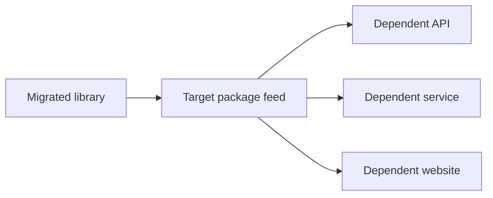

# Use Case: Standards-Driven Repository Modernization

## Summary

This simulated use case describes a portfolio of .NET repositories that must be migrated to new repository, build, testing, security, dependency, package-management, and continuous-integration standards.

Most repositories already follow established build patterns based on project type, such as libraries, websites, services, and APIs. The existing patterns are generally consistent, but they represent an older way of structuring projects, running builds and tests, managing dependencies, publishing packages, and configuring continuous integration.

The migration does more than replace one CI platform with another. It restructures repositories, modernizes project files, applies new standards, changes build and test commands, adds package health checks, moves packages to a central feed, updates dependent repositories, and records evidence that required outcomes are preserved.

The simulated environment uses Jenkins as the existing CI platform and Azure DevOps as the target platform. The use case is centered on the standards-driven migration process rather than those specific products.

## Objective

The objective is to apply new repository and build standards consistently across a portfolio of existing repositories through a repeatable migration process.

Each repository may have a different starting condition. The migration must inspect the repository, select the closest known migration profile, apply changes in validated phases, and prove that the new implementation satisfies the target standards while preserving required build and test outcomes.

Completed migrations produce evidence that can improve:

- Repository profiles
- Transformation tooling
- Validation rules
- Procedural guidance
- Complexity scoring
- Dependency knowledge
- Human decision rules
- Support for more complex repositories

The result is not merely a collection of migrated repositories. It is a migration capability that improves through repeated execution.

## Existing Environment

Most repositories use shared Jenkins build files selected by project type.

For example:

- Library repositories use a common library build
- Website repositories use a common website build
- Service repositories use a common service build
- API repositories use a common API build

A small number of repositories are outliers with specialized or older build behavior.

The existing CI implementation is generally consistent within each project type. The reason for migration is that it no longer represents the desired repository, build, test, dependency, security, and package-management model.

Repositories may contain:

- Legacy non-SDK-style `.csproj` files
- Older .NET Framework targets
- MSBuild-based restore and compilation
- VSTest-based test execution
- Main and test projects stored together
- Projects outside the target directory structure
- Inconsistent solution organization
- Local DLL references
- `packages.config` dependency management
- Outdated NuGet dependencies
- Repeated build and package properties
- Packages published to an existing local artifact repository
- Dependencies restored from the existing local artifact repository
- A `.sln` file without a corresponding `.slnx` file
- Missing or inconsistently named root files
- Repository-specific exceptions that have not been formally recorded

The existing build may work successfully. Migration success cannot therefore be determined only by whether files changed or whether the target pipeline completed.

## Expected Outcome

After migration, a repository:

- Conforms to the approved repository standards
- Conforms to the selected target build-template standards
- Uses an approved shared target build template
- Stores main projects under `src`
- Stores test projects under `test`
- Uses SDK-style project files where required
- Preserves the existing target framework during initial SDK conversion
- Uses multi-targeting when required by the selected profile
- Uses approved package references instead of local DLL references
- Uses approved NuGet dependency versions
- Uses a central package feed for approved .NET library packages
- Uses standardized build and package properties
- Contains required files with the correct names and casing
- Uses `.sln` as the canonical solution format
- Contains a generated `.slnx` equivalent to the `.sln`
- Restores, builds, and tests through the target CI platform
- Reports outdated and vulnerable packages
- Preserves required security checks
- Produces build and test results equivalent to the required existing CI results
- Has a migration record containing configuration, evidence, decisions, and approvals
- No longer depends on the existing CI implementation after the transition is approved and completed

See [Target Repository Standard](target-repository-standard.md) for the detailed expected state.

## Package Producer and Consumer Relationships

The target model moves .NET library packages from an existing local artifact repository to a central package feed.

When a library is migrated, its approved production package version is published to the target feed. Repositories that depend on the library must be identified and updated to use the approved package reference and feed.

These relationships affect migration order. A foundational library may need to migrate before the applications and other libraries that consume it.

## Common Migration Baseline

Every migrated repository must receive:

1. An approved target CI build template
2. Machine-readable repository conformance validation
3. Machine-readable build-template compatibility validation
4. Existing-to-target build and test comparison evidence
5. A migration record containing configuration, changes, results, and approvals
6. The required target directory structure
7. The required root files with correct casing
8. A canonical `.sln` and generated `.slnx`
9. Outdated-package reporting
10. Vulnerable-package reporting

Profile-specific requirements supplement this baseline. For example, `global.json` is added only when required by the selected profile.

## Migration Approach

Migration begins with a human-provided repository list.

Read-only inspection records repository attributes, estimates complexity, identifies dependency relationships, and selects the closest known migration profile. A human may correct the inventory, override a profile, or change migration priority.

Repositories are migrated in validated phases. Simpler repositories are attempted first so their evidence can improve the migration process before more complex scenarios are introduced.

See [Migration Process](migration-process.md) for the detailed workflow.

## Migration Profiles

A profile represents a known repository pattern. It defines:

- Matching repository attributes
- Required transformations
- Expected intermediate states
- Validation rules
- Known failure conditions
- Approved recovery actions
- Required evidence
- Human-approval conditions

The complete set of profiles is not expected to be known before migration begins. A migration may reveal that an existing profile needs configuration, revision, or replacement.

A new or revised profile must be validated and approved before it can be selected automatically for future migrations.

## Human Decisions as Reusable Learning

When a migration requires human approval, the request, evidence, decision, and reasoning are recorded.

The AI may propose a reusable decision rule based on that evidence. A human must explicitly approve or modify the matching conditions, permitted action, limitations, and conditions requiring renewed approval.

A one-time approval does not automatically expand future authority.

## Success Criteria

A repository migration succeeds when:

- The repository satisfies the common baseline
- The repository satisfies its approved migration profile
- The repository conforms to the repository standards
- The repository conforms to the selected build-template standards
- Every required migration phase passes validation
- SDK conversion preserves existing framework behavior
- Required multi-targeting builds and tests successfully
- The target CI builds all required projects
- The target CI discovers, executes, and passes the required tests
- Outdated and vulnerable packages are reported
- Required security controls remain active
- Existing and target build and test outcomes are equivalent
- Applicable production packages are published to the target package feed
- Published packages can be restored from the approved feed
- Known package consumers are identified
- Required consumer references are updated
- Intentional differences are documented and approved
- The migration is approved and merged
- The target CI succeeds from the merged branch
- The existing CI job is retired by a human
- Final migration status and evidence are recorded

## Expected Benefits

The migration should produce:

- Consistent application of repository standards
- Consistent target CI implementation
- Centralized build behavior
- Modernized project and solution formats
- Consistent repository structure
- Modern restore, build, and test execution
- Visibility into outdated and vulnerable packages
- Centralized package publication
- Consistent package references
- Reduced dependence on local DLLs and the existing artifact repository
- Repeatable migrations
- Clear evidence for human review
- Reusable migration profiles
- Reusable human decision rules
- Increasing support for complex repositories
- Reduced migration time for later repositories

## Boundaries

The use case does not authorize the AI to:

- Weaken required build, test, or security controls
- Remove unexplained existing behavior
- Publish unapproved production packages
- Retire the existing CI implementation without human action
- Activate a shared executable template change without approval
- Expand its own authority
- Treat a one-time human approval as a reusable rule without explicit authorization

## Supporting Documents

- [Target Repository Standard](target-repository-standard.md)
- [Migration Process](migration-process.md)
- [Repository Scenarios](repository-scenarios.md)
- [Worked Example](../worked-example.md)
