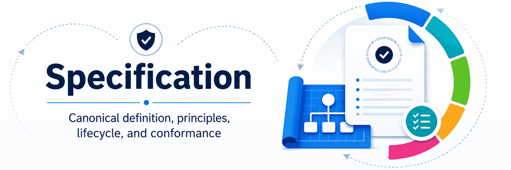

# Infoconex AI Flywheel Specification

> **Specification Version:** v0.1.3 — Draft

This section contains the official definition of the Infoconex AI Flywheel methodology. These documents define the model independently of comparisons to other frameworks or prior art.

The specification version describes the maturity of the methodology itself and is separate from repository, reference-implementation, or software release versions. The initial `v0.1.0` repository release published **Infoconex AI Flywheel Specification v0.1 — Draft**.

## Requirement Language

The words **must**, **should**, and **may** are used throughout the specification with these meanings:

- **Must** identifies a requirement that is necessary for conformance.
- **Should** identifies recommended behavior. An implementation may have a valid reason to take a different approach, but the underlying requirement still needs to be satisfied.
- **May** identifies behavior that is allowed but optional.

Architecture pages, examples, and research are explanatory support. They do not create specification requirements unless the specification itself incorporates their language as a requirement.

## Draft Stability

Version v0.1.3 is a working draft intended for public review, implementation experiments, and further research.

Readers should expect that:

- Terminology may be refined.
- Requirement wording may become clearer.
- Conformance guidance may evolve.
- More examples and implementation guidance may be added.
- Research conclusions may change as new primary sources are reviewed.

The eight principles and eight-stage lifecycle define the current structure, but this draft does not promise backward compatibility with future pre-v1.0 revisions.

## Table of Contents

- [Formal Definition](definition.md) — Defines the Infoconex AI Flywheel, human authority, governance, runtime responsibilities, learning destinations, and the core boundaries.
- [Principles](principles/README.md) — Defines the eight principles of the AI Flywheel, with a dedicated page for each principle.
- [Lifecycle](lifecycle/README.md) — Defines the recurring cycle: Execute, Observe, Evaluate, Classify, Adapt, Validate, Persist, and Reuse, with governance applied throughout.
- [Validation Sufficiency Requirements](validation-sufficiency.md) — Defines the minimum evidence conditions required before a candidate improvement or other reusable learning can be treated as sufficiently validated for persistent future use.
- [Persisted Learning Requirements](persisted-learning.md) — Defines what may count as persisted learning and the minimum properties required for durable future operational use.
- [Reuse Evidence Requirements](reuse-evidence.md) — Defines the minimum evidence required to demonstrate that relevant persisted learning actually influenced later execution.
- [Learning Supersession Requirements](learning-supersession.md) — Defines how persisted learning is challenged, revised, superseded, deprecated, invalidated, rolled back, or retired when later evidence changes what should be treated as current guidance.
- [Conformance](conformance/README.md) — Provides an evidence-based way to determine whether an implementation satisfies the specification.
- [Terminology](terminology.md) — Defines the standard terms used across the specification.
- [Architecture and Diagrams](../architecture/README.md) — Shows the complete operating model, runtime model, learning model, governance gates, escalation, and the relationship between the determinism and authority boundaries.
- [End-to-End Examples](../examples/README.md) — Shows how the specification can be applied to real operating processes without adding new requirements.

## Conceptual Model

The specification separates four ideas that should not be treated as one sequence:

1. **Human authority and governance** define the boundaries within which the Flywheel may operate.
2. **Procedural guidance, expressed through a Standard Operating Procedure (SOP), AI reasoning, and deterministic capability** work together during execution.
3. **The Flywheel lifecycle** turns execution evidence into validated and persistent learning.
4. **The Moving Determinism Boundary** determines where learned responsibility should live, while the **Authority Boundary** determines what the AI is allowed to decide or change on its own.

## Principle Reference Convention

When a principle is referenced by number, include its full name.

Use:

> **Principle 1: Autonomy Is Bounded by Human Authority**

Do not use a bare reference such as `Principle 1` or `P1`, including in prose, tables, diagrams, navigation, or related-document lists.

This keeps references understandable without requiring readers to memorize the principle numbers. A principle name may stand alone when the name itself is the clear reference.

## Scope

The specification answers the question: **What is the AI Flywheel?**

Comparisons, related work, and prior-art research are maintained separately in the [research section](../research/README.md).
