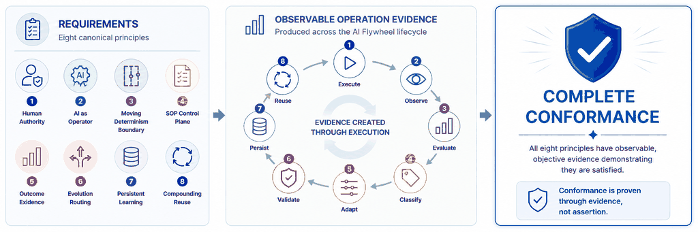

# Infoconex AI Flywheel Conformance

Conformance determines whether an implementation satisfies the complete Infoconex AI Flywheel Specification.

The conformance model does not create a separate set of requirements. The eight canonical [Principles](../principles/README.md) provide the top-level conformance structure, while the [Lifecycle](../lifecycle/README.md) defines the operational behavior through which those principles are exercised and evidenced. The [Formal Definition](../definition.md) remains the overall boundary for what constitutes an Infoconex AI Flywheel.

A complete conformance assessment therefore asks whether each canonical principle can be demonstrated through observable evidence from actual lifecycle operation. A system may contain individual AI Flywheel mechanisms without conforming to the complete methodology.

## Conformance Model

Conformance follows a simple relationship:

**Requirements → Observable operation evidence → Conformance decision**

1. **Requirements** — The eight canonical principles define the enduring requirements of the operating model.
2. **Observable operation evidence** — Execution across the lifecycle produces evidence showing how those requirements behave in practice.
3. **Conformance decision** — An implementation conforms only when the complete set of principle requirements is demonstrated through objective evidence and the required lifecycle behavior is present.

This structure keeps conformance aligned with the specification instead of introducing a separate vocabulary of assessment areas.

## Principle-Aligned Assessment

A complete conformance review evaluates each canonical principle using evidence from the lifecycle stages and governance behavior most relevant to that principle.

| Principle | What Must Be Demonstrated | Primary Lifecycle Relationship |
|---|---|---|
| [**1. Autonomy Is Bounded by Human Authority**](../principles/01-human-authority.md) | Human-defined authority boundaries govern autonomous operation and persistent change. The AI cannot grant itself additional authority, prohibited actions are blocked, and insufficient evidence or required judgment is escalated appropriately. | Applies before and throughout all lifecycle stages; supported by [Governance and Escalation](../../architecture/governance-and-escalation.md). |
| [**2. AI Is the Operator, Not Merely the Assistant**](../principles/02-ai-as-operator.md) | AI performs meaningful operational work and can continue within delegated authority rather than merely producing instructions for a human operator. | [Execute](../lifecycle/01-execute.md) |
| [**3. Work Is Distributed Across a Moving Determinism Boundary**](../principles/03-moving-determinism-boundary.md) | Deterministic capability, procedural guidance, and AI reasoning have clear and intentional responsibilities, and those responsibilities can move when evidence shows a different placement is more appropriate. | [Execute](../lifecycle/01-execute.md), [Classify](../lifecycle/04-classify.md), [Adapt](../lifecycle/05-adapt.md) |
| [**4. The SOP Is an Operational Control Plane**](../principles/04-sop-control-plane.md) | A durable Standard Operating Procedure (SOP), or equivalent machine-consumable guidance, directs how work is performed, handles known conditions, defines evidence and escalation expectations, and remains subject to governance. | [Execute](../lifecycle/01-execute.md), with later adaptation, persistence, and reuse |
| [**5. Execution Must Produce Outcome Evidence**](../principles/05-outcome-evidence.md) | Execution produces enough objective evidence to determine what actually happened and whether the intended outcome was achieved. Success, failure, partial success, and unresolved uncertainty can be distinguished without relying only on model confidence or task completion. | [Observe](../lifecycle/02-observe.md), [Evaluate](../lifecycle/03-evaluate.md), [Validate](../lifecycle/06-validate.md) |
| [**6. Failure Determines Where the System Evolves**](../principles/06-evolution-routing.md) | Failures and other learning opportunities are classified and routed to the part of the system best suited to own the improvement. Successful outcomes may also reinforce validated patterns that should continue to be reused. | [Evaluate](../lifecycle/03-evaluate.md), [Classify](../lifecycle/04-classify.md), [Adapt](../lifecycle/05-adapt.md) |
| [**7. Learning Must Change a Persistent Operational Asset**](../principles/07-persistent-learning.md) | Validated and authorized learning changes a durable operational asset that survives the current execution and can affect future behavior. | [Validate](../lifecycle/06-validate.md), [Persist](../lifecycle/07-persist.md) |
| [**8. Improvement Must Compound Through Reuse**](../principles/08-compounding-reuse.md) | Later executions actually use relevant validated improvements so capability, reliability, or efficiency can improve over time rather than repeatedly starting from the same state. | [Reuse](../lifecycle/08-reuse.md), which becomes part of the starting state for the next [Execute](../lifecycle/01-execute.md) |

The same evidence may support more than one principle, and a single principle may require evidence from multiple lifecycle stages. The purpose of the mapping is traceability, not to create one-to-one relationships between principles and stages.

## Evidence-Based Assessment

A conformance claim must be supported by observable evidence rather than labels, architecture diagrams, or stated intent alone.

Evidence may include:

- Governance policies and authorization records.
- SOPs or other persistent procedural assets.
- Execution traces and tool outputs.
- Outcome observations and evaluation records.
- Classification and improvement-routing decisions.
- Tests and validation results.
- Material human judgments and approvals.
- Persistent changes produced by earlier execution.
- Later executions showing that those changes were reused.

Evidence should be attributable enough for a reviewer to determine what happened, why a conclusion was reached, and how the evidence demonstrates the relevant principle requirements.

The exact technology used to satisfy the specification may vary. Conformance evaluates required behavior rather than requiring a specific language, framework, model, storage system, or infrastructure platform.

## Conformance Decision

A system conforms to this version of the Infoconex AI Flywheel Specification when it can demonstrate, through objective evidence from actual operation, that all eight canonical principles are satisfied and that the complete lifecycle behavior required by the specification is present.

When a principle is not satisfied, the implementation may still use valuable AI Flywheel concepts, but it should not be described as a complete conforming implementation.

This version does not define partial or maturity-based conformance levels. A future version may add maturity levels for areas such as autonomy, persistence, self-modification, governance, validation, and escalation. Until then, those levels are not part of the specification.

## Supporting Evaluation Documents

- [Conformance Evaluation Checklist](evaluation-checklist.md) — Practical questions organized around the eight canonical principles and the lifecycle evidence used to demonstrate them.
- [Non-Conforming Patterns](non-conforming-patterns.md) — Common patterns that contain useful Flywheel elements but do not satisfy the complete methodology.

## Related Documents

- [Formal Definition](../definition.md)
- [Terminology](../terminology.md)
- [Principles](../principles/README.md)
- [Lifecycle](../lifecycle/README.md)
- [Core Operating Model](../../architecture/operating-model.md)
- [Worked Example: Continuous Dependency Maintenance](../../examples/software-maintenance/worked-example.md)
