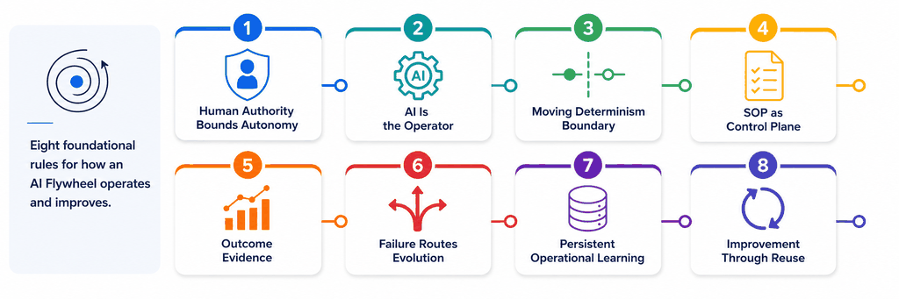

# Infoconex AI Flywheel Principles

These eight principles define the expected behavior of an implementation of the Infoconex AI Flywheel. Together they describe how human authority, AI operation, deterministic capability, procedural guidance, evidence, learning, and reuse work as one operating model.

## Principle Document Structure

Each principle document uses the same basic structure so readers can clearly separate explanation from requirements and see how the principle relates to operation, lifecycle, evidence, and conformance.

The standard sections are:

1. **Purpose** — Why the principle exists and what problem it addresses.
2. **Requirements** — The requirements an implementation must satisfy.
3. **Operational Model** — How the principle works in practice.
4. **Lifecycle Relationship** — Where the principle participates in the AI Flywheel lifecycle.
5. **Evidence of Implementation** — Observable evidence that can support a conformance assessment.
6. **Non-Conforming Patterns** — Common patterns that look similar but do not satisfy the principle.
7. **Relationships to Other Principles** — Important connections to the other principles.

A principle may include extra sections inside the Operational Model when more detail is useful. Governance and authority are covered where they matter instead of being repeated in every document.

The Requirements section is the source of the actual specification requirements. Evidence examples and non-conforming patterns help explain and assess those requirements but do not add new ones.

## Table of Contents

1. [Principle 1: Autonomy Is Bounded by Human Authority](01-human-authority.md) — Human authorization establishes the boundaries within which the Flywheel operates autonomously and defines when human judgment or approval is required.
2. [Principle 2: AI Is the Operator, Not Merely the Assistant](02-ai-as-operator.md) — AI performs the work, invokes capabilities, interprets results, handles exceptions, and carries the process forward.
3. [Principle 3: Work Is Distributed Across a Moving Determinism Boundary](03-moving-determinism-boundary.md) — Responsibility is deliberately divided among deterministic capability, procedural guidance, and AI reasoning, and may move as evidence accumulates.
4. [Principle 4: The SOP Is an Operational Control Plane](04-sop-control-plane.md) — The Standard Operating Procedure (SOP) provides persistent machine-consumable guidance for execution, capability use, known exceptions, validation, evidence, and escalation.
5. [Principle 5: Execution Must Produce Outcome Evidence](05-outcome-evidence.md) — The Flywheel learns from observable results rather than relying on AI confidence alone.
6. [Principle 6: Failure Determines Where the System Evolves](06-evolution-routing.md) — Observed weaknesses are classified and sent to the part of the system best suited to correct them.
7. [Principle 7: Learning Must Change a Persistent Operational Asset](07-persistent-learning.md) — Reusable learning must survive the current execution in a durable asset available to future operation.
8. [Principle 8: Improvement Must Compound Through Reuse](08-compounding-reuse.md) — Validated improvements are used by future executions so the operating state becomes more capable over time.

## How the Principles Fit Together

The principles form one operating model rather than eight independent features:

**Human authority bounds autonomy → AI operates the process → work is divided across code, procedure, and reasoning → execution produces evidence → evidence determines where the system should evolve → validated learning persists → future execution reuses the improved operating state.**

## Related Documents

- [Formal Definition](../definition.md)
- [Terminology](../terminology.md)
- [Lifecycle](../lifecycle/README.md)
- [Conformance](../conformance/README.md)
- [Core Operating Model](../../architecture/operating-model.md)
- [Framework Comparison Research](../../research/frameworks/framework-comparison-matrix.md)